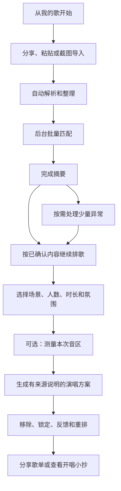

# 歌单导入与排歌价值闭环设计

## 1. 背景与问题

当前版本已经具备导入解析、歌曲整理、本地参考匹配、偏好画像、音区测量、场景编排、反馈重排和导出能力，但用户实际感知到的链路仍然断裂：

- 导入完成后，页面主要反馈“解析了多少首”“参考命中了多少首”，没有说明这些结果接下来会改变什么。
- 匹配页把逐首核对放在最显眼的位置。歌单越大，越像一项必须做完的人工任务。
- “测一下音域”“去选场景”描述的是下一步操作，不是用户最终能得到的结果。
- 结果页没有清楚展示原歌单歌曲与补充推荐的构成，用户无法验证导入是否真的参与排歌。
- “本地参考命中”“外部候选”等内部概念较多，容易被误解为真实 KTV 门店可点或完整音乐平台曲库。

因此，本轮不是单纯扩大曲库或调整几个按钮，而是重新建立一条可理解、可恢复、可验证的完整价值链。

## 2. 核心定位

歌单导入的核心价值定义为：

> 把用户平时爱听的歌，整理成更适合当次场景、更容易接唱、顺序更合理的演唱方案。

导入不是以下能力：

- 不搬运音乐平台的音频、歌词、封面或播放权限。
- 不等于把歌曲同步进一个可播放的本地音乐库。
- 不代表歌曲在任一地区、门店或设备中实时可点。
- 不要求用户把整份歌单逐首确认后才能继续。

匹配只是中间的质量步骤。用户可感知的终点是：

1. 知道这份歌单已经有多少内容可用于排歌。
2. 看见系统从歌单中理解到的偏好和演唱特征。
3. 得到一份有顺序、有来源说明、有推荐理由的演唱方案。
4. 能通过简单反馈继续调整并分享结果。

## 3. 已选方案

### 3.1 方案比较

#### 方案 A：匹配优先

导入后先要求用户完成逐首核对，再进入画像和排歌。

- 优点：每一条数据都经过人工确认。
- 缺点：操作量随歌单歌曲数线性增长，几百首歌无法实际使用；用户会把匹配误认为产品终点。

#### 方案 B：完全自动

所有候选都自动采用，直接生成结果。

- 优点：速度快，用户几乎没有操作。
- 缺点：同名歌曲、缺歌手、翻唱版和现场版容易误认；错误候选会污染画像和推荐。

#### 方案 C：闭环优先、异常后置

系统只自动采用歌名身份、歌手身份和版本身份兼容且候选唯一的歌曲；缺歌手、版本冲突、相近匹配和替代建议进入异常区。用户可以先按已确认内容排歌，异常项稍后再处理。

- 优点：大歌单的操作量取决于异常数，而不是歌曲总数；同时守住推荐可信度。
- 缺点：需要清楚区分“已核对”“待确认”“暂未找到”，并在推荐入口严格过滤未确认候选。

本设计采用方案 C。

## 4. 产品原则

1. **结果先于过程**：页面先告诉用户可以得到什么，再解释系统如何处理。
2. **自动处理正常项**：歌名、歌手、版本身份兼容且候选唯一的结果自动进入可用集合，不要求逐首点击。
3. **异常不阻塞主流程**：待确认和未找到歌曲单独收纳，不阻止按已确认歌曲排歌。
4. **来源必须可见**：最终结果明确区分原歌单歌曲、根据偏好补充的歌曲和待核对外部候选。
5. **确定性结论只使用确定性数据**：未确认候选不能进入偏好画像、推荐池、风险判断或结果数量。
6. **所有数字可追溯**：页面展示的导入数、已核对数、待确认数、原歌单入选数、采用替代歌曲数和补充数必须由同一份运行时数据计算，不能写死。
7. **操作量不随歌单规模线性增长**：100 首、500 首或 1000 首歌单不应转化成对应数量的人工确认任务。
8. **不夸大数据能力**：本地参考只用于早期推荐验证；公开搜索结果只提供候选元数据。

## 5. 端到端用户流程

### 5.1 首页

首页不再把“导入歌单”和“核对参考匹配”展示成两个并列目标。顶部只给出一个随当前状态变化的主要动作。

#### 没有导入内容

- 标题：`把常听歌单，变成今晚更好唱的顺序`
- 说明：`导入后会整理歌名、核对歌曲参考，再结合场景和可选音区排成一份可以直接分享的歌单。`
- 主操作：`导入我的歌单`
- 次操作：`先用示例看看`

#### 已导入、尚未完成匹配

- 标题：`《歌单名》已经放进来了`
- 摘要：`共 N 首，正在核对歌曲参考。完成后就能按这份歌单排歌。`
- 主操作：`继续准备这份歌单`

#### 匹配已完成或部分完成

- 标题：`这份歌单已经可以用来排歌`
- 摘要：`N 首已核对，M 首待确认；待确认歌曲不会影响继续排歌。`
- 主操作：`按这份歌单排今晚歌单`
- 次操作：`查看待确认歌曲`

#### 已有计划

- 标题：`今晚歌单已经排好`
- 摘要：`共 N 首，其中 X 首来自《歌单名》，R 首是你选的替代歌，另外补了 Y 首本地参考歌曲。`
- 主操作：`继续调整`
- 次操作：`发给朋友`、`查看开唱小抄`

### 5.2 导入入口

保留三种真实可达方式：

1. 分享或粘贴歌单链接。
2. 粘贴歌曲文字。
3. 一次选择 1–20 张歌单截图并在本机批量识别。

来源边界：

- Apple Music 与网易云音乐官方公开歌单页可以尝试直接读取公开内容。
- QQ 音乐仅有链接时不承诺直接读取；提示用户分享包含歌名的原文、粘贴歌曲文字或使用截图。
- 登录墙、私密歌单、动态页面和仅 App 内可见内容无法可靠读取时，不显示为“识别失败，请重试”，而是给出明确替代方式。
- 不调用音乐平台私有接口，不绕过登录或访问控制。

入口文案：

- 页面标题：`选一种方式导入`
- 链接输入说明：`粘贴公开歌单链接；如果页面不能直接读取，可以改用分享原文或截图。`
- 文本输入说明：`一行一首，带上歌手会识别得更准。`
- 截图说明：`可一次选择最多 20 张歌单截图，歌名识别只在本机进行。`

多截图是本轮早期闭环与公开发布的强制能力。所有限制只读取同一 `ScreenshotBatchImportLimits`：`maxImageCount = 20`、`maximumTotalBytes = 120 MiB`、`maximumTotalPixels = 160_000_000`、`maximumConcurrency = 2`。数量、每张 `width × height`、总字节和总像素都使用 `reportingOverflow` 在 OCR 前完成 preflight；任一溢出或超限立即拒绝并保留上一份稳定工作流。边界合同必须证明 20 张、每张 6 MiB 且 8,000,000 像素的最坏合法批次恰好通过，增加 1 byte、1 pixel 或第 21 张都失败。

批次按用户选择顺序编号，跨图歌曲按标准 semantic key 保留首次出现顺序。页面显示 `正在识别 i/n`；部分失败时明确显示 `已识别 m/n 张`、失败序号和重试入口，不能静默丢图。只有当前 generation 的完整批次至少一张成功、合并结果非空并通过导入校验后，才原子替换整理候选；全部失败、取消、超限、超时或旧批次迟到均保留上一份稳定工作流。

原图只存在于受控临时目录，不进入工作流快照。成功图片完成读取后立即删除；失败图片只由当前导入页面的 15 分钟 `ScreenshotBatchRetrySession` 持有，以便逐张重试。重试成功即删除对应文件；全部成功、用户选择“使用已识别结果继续”、明确放弃、取消、离开页面或 session 到期时必须清理全部剩余文件。session 不持久化，异常终止后的 orphan cleaner 删除残留；重启只恢复失败数量/序号并提示“重新选择失败图片”，不承诺对旧临时文件直接重试。

### 5.3 解析与整理

解析过程按阶段反馈，不使用笼统的“处理中”：

1. `正在读取歌单内容`
2. `正在整理歌名和歌手`
3. `正在去除重复内容`
4. `已整理 N 首歌`

整理规则：

- 自动去除完全重复的歌曲条目，保留原始顺序。
- 空歌名不能进入匹配。
- 低置信度 OCR、明显缺失的歌名或被错误拆行的内容进入“需要看一眼”，不要求用户检查所有歌曲。
- 用户可以批量删除明显无效条目，也可以编辑单首歌名或歌手。
- 大歌单默认只展开需要处理的条目；完整列表按需查看，并使用分批或懒加载展示。

解析完成态：

- 标题：`N 首歌已经整理好`
- 说明：`下一步会核对歌曲参考，用来判断难度、合唱适配和排歌顺序；这不代表 KTV 门店实时可点。`
- 主操作：`核对歌曲参考，继续排歌`

### 5.4 批量匹配

每首有效整理歌曲在匹配完成后必须且只能处于一种内部状态。新实现使用受约束的 `SongMatchDisposition` 表达，不再依赖 `MatchStatus × MatchConfirmationState × matchedTrack? × alternatives` 的任意组合：

| 内部状态 | 进入规则 | 用户状态 | 可进入画像和正式计划 |
| --- | --- | --- | --- |
| `acceptedOriginalExact` | 歌名身份、歌手身份和版本身份兼容，并且兼容候选唯一 | 已核对 | 是，来源为原歌单 |
| `acceptedOriginalConfirmed` | 用户从同名或相近候选中明确确认原曲身份 | 已核对 | 是，来源为原歌单 |
| `identityConfirmationRequired` | 未满足 `acceptedOriginalExact`，但存在同名候选、缺少歌手、兼容候选不唯一、版本标签未知或冲突，或最佳相似度不低于 0.78 | 待确认 | 否 |
| `alternativeSuggested` | 最佳相似度不低于 0.60 且低于 0.78，只能作为替代建议 | 待确认 | 否 |
| `adoptedAlternative` | 用户明确采用 `alternativeSuggested`，或主动把已核对原曲换成另一个本地参考 | 已核对 | 是，来源为用户采用的替代歌 |
| `unmatched` | 最佳相似度低于 0.60，或本地参考中没有候选 | 暂未找到 | 否 |

判定顺序固定为：先检查四项自动采用条件；未通过时，只要存在同标题身份、歌手或版本冲突，或最佳相似度不低于 0.78，就进入 `identityConfirmationRequired`；其余分数在 `[0.60, 0.78)` 的结果进入 `alternativeSuggested`；最后才是 `unmatched`。因此同一轮判定不会同时落入两个状态。

自动采用只允许 `acceptedOriginalExact`，并且以下四项必须同时成立：

1. 导入歌名与候选主标题或“同一歌曲身份别名”规范化后完全一致。
2. 导入歌手存在，并与候选歌手或已维护歌手别名匹配。
3. 双方版本身份兼容：Live/现场、翻唱/Cover、Remix/DJ、伴奏、剪辑/Edit 等标签规范化后的集合完全相同；双方都没有版本标签也视为兼容。任一方有未知版本字样、只有一方带版本标签或标签集合不同，均不兼容。
4. 经过歌名、歌手和版本过滤后只有一个稳定曲目候选。

现有通用 `aliases` 只用于发现候选，不能直接作为自动采用依据。带有 Live、现场、翻唱、Cover、Remix、DJ、伴奏、剪辑或 Edit 标记的别名一律是“搜索别名”，除非本地曲目本身维护了完全相同的版本身份，否则只能进入待确认。实施时增加独立的同身份标题别名或等价过滤策略，避免标题规范化删除版本字样后误认。

即使本地参考中只有一个同名候选，只要导入内容缺少歌手，也必须进入 `identityConfirmationRequired`；它可以被跳过，但不能被静默当成原曲。相似度阈值只负责候选分组，不足以单独形成确定性身份结论。

三个用户状态的统计口径：

- `已核对数 = acceptedOriginalExact + acceptedOriginalConfirmed + adoptedAlternative`
- `待确认数 = identityConfirmationRequired + alternativeSuggested`
- `暂未找到数 = unmatched`
- `有效整理数 = 已核对数 + 待确认数 + 暂未找到数`

状态转换只允许：

- `identityConfirmationRequired → acceptedOriginalConfirmed`：用户点击“就是这首”，明确确认候选与导入歌曲是同一歌曲身份。
- `identityConfirmationRequired → adoptedAlternative`：用户点击“用这首替代”，明确表示候选并非原曲身份，只作为替代使用。
- `alternativeSuggested → adoptedAlternative`：用户明确采用替代歌。
- `acceptedOriginalExact / acceptedOriginalConfirmed → adoptedAlternative`：用户主动换成其他本地参考。
- 任意状态在歌名、歌手或版本信息编辑后失效，按新的整理修订重新匹配。

“暂不处理”只是界面筛选和继续意图，不改变歌曲内部状态。待确认歌曲恢复后仍保持待确认，也不会因为用户继续排歌而自动转为已核对。

已核对歌曲可以进入偏好画像、正式推荐候选池以及难度、高音、合唱和场景等确定性统计。待确认和暂未找到歌曲均不能进入；导入文本中明确存在的歌手名称仍可作为弱偏好信号，但不能由候选反推用户偏好。

批量操作只提供安全动作：

- `先按已核对歌曲排歌`
- `暂不处理全部待确认歌曲`
- `只看待确认`
- `只看暂未找到`

不提供“全部采用第一候选”之类会批量制造错误身份的操作。

页面结构：

1. 顶部先显示完成摘要和继续排歌按钮。
2. 中部显示歌单分析摘要。
3. 底部才是可折叠的歌曲明细。
4. 默认只展开异常项；已核对列表折叠，并按批次加载。

完成态文案：

- 全部完成：`N 首歌曲参考已核对，可以开始排歌了。`
- 部分完成：`已核对 X/N 首，Y 首待确认，Z 首暂未找到。可以先按已核对内容排歌。`
- 没有可用参考但导入内容带有歌手：`暂时没有找到可用的本地参考。可以按导入内容中的歌手和当前场景排一份基础歌单，歌曲难度和音区判断会相应减少。`
- 没有可用参考且没有可靠歌手：`暂时没有可用于排歌的匹配。可以继续核对，也可以先按热门 K 歌参考排一版。`

主操作统一为：`按这份歌单排一版`

### 5.5 歌单分析

歌单分析用于解释系统从已确认数据中理解到了什么，不把图表本身当作最终价值。

展示内容：

- 常听歌手。
- 主要语种、年代和曲风。
- 合唱友好度、整体难度和高音压力。
- 更适合的场景。

首屏使用自然结论，例如：

> 华语流行和熟悉旋律比较多，周杰伦、孙燕姿经常出现。朋友局可以先用大家会接的歌热场，高音较多的歌放到状态起来以后。

统计不足时明确说明依据有限，不输出精确画像。

### 5.6 场景与音区

场景页必须让用户看见刚才导入的内容仍在参与本次排歌。

固定显示本次输入摘要：

> 本次会使用：N 首导入歌曲 · X 首已有参考 · 朋友局 · 6 人 · 90 分钟 · 常见音区参考

用户可调整：

- 场景。
- 人数。
- 时长。
- 氛围。
- 难度偏好。
- 合唱偏好。

音区测量是增强项，不是继续排歌的门槛：

- 主流程按钮：`按以上条件排歌`
- 可选操作：`测一下本次音区，排得更贴合`
- 未测量时使用明确标记的常见音区参考，不写成用户个人实测。

### 5.7 结果页

结果页首先回答“刚才导入的歌单到底起了什么作用”。

计划级摘要：

> 根据《歌单名》、朋友局 6 人和 90 分钟时长，共排出 N 首：其中 X 首来自原歌单，Y 首是根据常听歌手和曲风补充的歌曲。

如果用户主动采用过替代歌曲，摘要必须单独计数：

> 共排出 N 首：X 首来自原歌单，R 首是你选的替代歌，另外补了 Y 首本地参考歌曲。

每首歌曲必须持久化并展示来源之一：

- `来自你的歌单`
- `你选的替代歌`
- `同歌手补充`
- `按曲风补充`
- `按场景补充`
- `热门补充`

来源与推荐理由是两个维度。来源回答“这首歌从哪里来”，推荐理由回答“为什么这样排”。推荐理由可以包括：

- `副歌好接，适合朋友一起唱`
- `和这场的氛围比较搭`
- `本次唱到的音区与歌曲接近`
- `高音较多，状态起来后再唱`

正式计划数量严格满足：

> `N = 原歌单入选数 X + 用户采用替代数 R + 本地补充推荐数 Y`

外部公开候选数量单独记为 `E`，不计入 N。结果页可以在正式演唱顺序之后显示独立的 `还有 E 首同歌手公开候选待核对` 卡片，但这些候选不占用计划容量、不参与场景硬规则，也不输出未知的难度、音区或 KTV 可用性判断。

结果页主要操作顺序：

1. ready 多人结果为 `进入开唱模式`，单人练歌为 `开始练唱`
2. `发给朋友` 或 `保存练唱单`
3. `继续调整`
4. `调整场景`

第一主行动点击一次直接进入当前正式 plan 的开场、下一首和收尾顺序，不经过导出页；stale、无 plan 或 basis 已变化时改为“重新排歌”，不能进入过期小抄。该入口只提供顺序和现场提示，不承诺音频播放、第三方点歌或 KTV 设备控制；外部候选 E 不进入开唱模式。

### 5.8 反馈与重排

用户可以对单曲选择多个互不覆盖的反馈：

- 喜欢。
- 太高。
- 不熟。
- 会唱（旧数据 raw value `sung` 保持兼容，用户界面不再显示“唱过”）。
- 适合合唱。
- 不想唱或直接移除。

反馈后立即重排，并给出可验证的完成反馈：

> 已根据你的 3 条反馈重新调整：2 首高音歌曲已后移，1 首不熟悉的歌曲已替换。

如果实际变化无法支持具体描述，则使用保守文案：

> 已根据你的 3 条反馈重新调整歌单。

用户可以进入“管理反馈”查看、修改或清除全部持久化记录，包括已经不在当前 plan 的歌曲；也可以撤销最近一次反馈或恢复已移除歌曲。锁定歌曲不会在重排时静默消失。“会唱”表示跨会话熟悉度，不表示“本场已经唱完”；未来若增加现场完成状态，必须使用独立 session-scoped 字段。

旧反馈 JSON 的 decoder 是纯函数：只恢复 trackID、kinds 和确定性占位，不读取曲库或当前时间。随后由 persistence 显式调用 `SongFeedbackMigration.migrate(profile:catalog:now:)`，注入 catalog 与时钟补齐名称/时间，并仅在发生变化时回写；decoder 与 migration 必须分别测试。

反馈提交采用两阶段语义：先持久化 candidate profile，成功后才发布内存反馈并增加一次 `feedbackRevision`、把旧 plan 转 stale、触发重排。只有反馈持久化本身失败才回滚反馈、不增加 revision，旧 ready plan 可继续使用；反馈已持久化但重排失败时，新反馈和 revision 必须保留，旧 plan 只能以 stale 内容查看，导出、分享和开唱入口全部禁用，并提供重试。

### 5.9 分享与现场使用

分享内容延续结果页的可信边界：

- ready 结果页通过“进入开唱模式/开始练唱”一次点击进入正式计划顺序；stale 不可进入，E 不参与。
- 群聊精简文本只包含场景、分段、顺序和歌名。
- 详细文本可以包含来源、推荐理由、注意事项和备选歌。
- 海报和开唱小抄不展示内部评分。
- 正式分享、海报、详细文本和开唱小抄都不包含外部公开候选；候选只在 App 内独立区域展示，并始终保留“待核对”标识。

## 6. 本地参考曲库与联网查询

### 6.1 本地参考曲库的本轮边界

当前约 215 首本地参考曲库只作为 Task 1–22 的演唱属性和推荐规则验证数据，不能单凭数量宣称公开消费级覆盖。早期验证版仍不使用公开元数据自动伪造难度、音区、高音风险、合唱分数或场景标签。

为守住歌曲身份，本轮会给本地曲目补充可解码兼容的版本身份和别名语义：`versionTags` 记录规范化版本集合，“同一歌曲身份别名”只允许错别字、繁简体、外文名或正式别称等不改变版本的写法；现有带 Live 等版本词的通用别名降级为搜索候选，不再触发自动采用。旧曲库没有 `versionTags` 时按空集合解码，但只在导入歌曲同样没有版本标签且唯一候选满足全部身份条件时自动采用。

公开 To C 发布把曲库交付拆为 Task 24A 机器合同和 Task 24B 真实数据/权利交付。24A 建立版本 manifest、摘要、重复/碰撞、覆盖和性能门禁；24B 必须实际修改正式曲库资源，按覆盖缺口报告补齐或清理数据，并取得来源、负责人和使用权证据。不得用任意总首数代替覆盖验收。两阶段至少遵循：

- 每首歌曲有稳定 ID、规范化歌名、歌手、版本和来源记录。
- 只有经过明确维护和校验的数据才能带有演唱属性。
- 只有歌名、歌手、专辑和公开链接的数据进入元数据候选层，不进入确定性推荐。
- 扩充必须有曲库修订号，并运行重复项、别名冲突、规范化碰撞、属性完整性和匹配性能门禁。

最低公开数据门槛是每个经产品批准的 launch coverage case 都达到批准目标，并能生成当前 30 首上限的合法唯一歌曲；精确目标由覆盖用例和负责人批准，不从现有 180/215 下限推断。权利材料、第三方合同或负责人确认缺失时，24B 保持 BLOCKED，即使机器测试通过也不能发布。这样既不阻塞早期验证版核心闭环，也不把公开发布所需真实数据留成空泛后续项。

### 6.2 联网查询

当前可用的轻量方案是 Apple iTunes Search 公开接口，用于查找同歌手公开曲目元数据。它能返回歌名、歌手、专辑和公开链接，但不能回答：

- 是否在某家 KTV 可点。
- 适合什么音区。
- 演唱难度。
- 高音风险。
- 是否适合合唱或某种现场场景。

因此联网结果只能作为“公开候选 · 待核对”，不能自动补齐本地参考属性，也不能伪装成相似歌曲算法。

联网失败、超时或取消时：

- 已完成的本地匹配和排歌能力不受影响。
- 页面提示：`暂时没找到更多公开候选，可以先用已经核对的歌曲排歌。`
- 旧歌单的迟到响应不得写入当前歌单。

## 7. 数据与架构设计

### 7.1 逐导入条目账本与派生摘要

每个 parser 去重后的 `ImportedSong.id` 必须在 `PlaylistReconciliationLedger` 中且只出现一次。`PlaylistReconciliationEntry` 以 importedSong stable ID 唯一，不以最终 trackID 去重，并将两个不同时序的事实拆开保存：

- 稳定的 `reviewMatchOutcome`：`reviewRemoved / activeAwaitingMatch / pending / unmatched / verifiedOriginal(trackID) / verifiedAdoptedAlternative(trackID)`。
- 可变的 `planDisposition`：`notGenerated / selectedOriginal(planItemID, trackID)`（X）`/ selectedAlternative(planItemID, trackID)`（R）`/ verifiedNotSelected(resolvedTrackID, reason)`（Q）。

所有 entries 的 `planDisposition`、完整 `supplements` 与 `dispositionPlanBasis` 共同组成不可拆分的 plan projection snapshot，必须一起写入、恢复、失效或替换，禁止按受影响条目局部混写。

五个提交点必须可独立表达：

1. 导入完成：有效条目为 `activeAwaitingMatch + notGenerated`，整理删除条目为 `reviewRemoved + notGenerated`。
2. 匹配中：完整账本继续显示上一个稳定 `reviewMatchOutcome`；进度只存在于 operation state，不逐条发布半份匹配。
3. 匹配完成但尚未排歌：没有旧 projection 时，原子提交 `verifiedOriginal / verifiedAdoptedAlternative / pending / unmatched`，并保持“全量 `notGenerated` + 空 supplements + nil basis”。
4. plan stale：`reviewMatchOutcome` 按新事实提交；旧 projection 若保留，必须连同全部 dispositions、supplements 和旧 basis 原样作为 stale snapshot 保留，导出、分享和开唱继续关闭。
5. 重排成功：只有新 plan、basis、全量 dispositions 与 supplements 都通过校验时，才原子替换整个 projection；失败保留旧 stale projection 整体不变。

本地补充 Y 使用独立 `PlaylistSupplementEntry`，不伪装成导入条目。两个导入条目可以因 alias、版本归并或重复内容命中同一个 track，但仍保留两个 entry；最终归属固定按 `(importedPlaylistOrder, importedSong.id.uuidString.lowercased())` 取最小者为 X/R，其余必须以 Q 和具体原因解释。锁定、容量截断、alias/版本归并和重排都沿用同一 tie-break；测试将输入随机排列至少 100 次以锁定确定性。

增加由 ledger 单次遍历派生的展示模型，避免各页面自行拼接或反向手填数字：

- `PlaylistPreparationSummary`
  - 导入歌曲总数。
  - 有效整理数。
  - 已核对数。
  - 待确认数。
  - 暂未找到数。
  - 是否允许继续排歌。

`PlaylistPreparationSummary` 永远只从 `reviewMatchOutcome` 派生；当 projection 为“所有条目 `notGenerated` + 空 supplements + nil basis”时，`SongPlanGenerationSummary` 必须为 `nil`，不能把“尚未排歌”伪装成 X/R/Q 均为零。ready/stale 的计划摘要只从同一 `dispositionPlanBasis` 对应的全量 dispositions 与 supplements 派生。两种 summary 都不提供接收计数字段的 public initializer。ledger 必须校验 importedSong ID 集合完整相等、双阶段值合法、selected/supplement planItemID 集合与正式 plan.items 完全相等且无重复。旧快照不能证明 projection 三部分属于同一 basis 时，不得从汇总数字反向制造 entries，只能恢复为 stale 并重新分析。

歌名/歌手编辑、整理删除/撤销或匹配变化可以更新 `reviewMatchOutcome`，但对旧 projection 只能二选一：A）完整保留为 stale snapshot；B）一次把所有 entries 的 disposition 置为 `notGenerated`，同时清空 supplements 与 basis。反馈、场景、音区、锁定和结果页移除等 plan controls 只递增对应 revision 并把 plan 转 stale；它们不得改变 `reviewMatchOutcome`，也不得在重排成功前预改 projection 的任何部分。

### 7.2 推荐来源

增加可编码的歌曲来源枚举 `SongRecommendationOrigin`：

- `importedMatch`
- `adoptedAlternative`
- `sameArtistSupplement`
- `styleSupplement`
- `sceneSupplement`
- `popularSupplement`
- `legacyUnknown`

`SongPlanItem` 在生成时记录来源；旧快照解码时回退为 `legacyUnknown`。结果页、详细导出和恢复后的计划都读取同一字段，不在界面层重新猜测来源。

同一首歌只能有一个主来源，生成时按以下顺序判定：

1. 用户明确采用的替代歌曲记为 `adoptedAlternative`。
2. 与当前歌单已核对原曲对应的歌曲记为 `importedMatch`。
3. 同歌手补充记为 `sameArtistSupplement`。
4. 曲风或情绪补充记为 `styleSupplement`。
5. 仅因当前场景进入的歌曲记为 `sceneSupplement`。
6. 热门兜底记为 `popularSupplement`。
7. 无法从旧快照判断来源时记为 `legacyUnknown`，不得根据当前状态反向猜测。

这样可避免一首歌同时被统计为“来自原歌单”和“同歌手补充”，并保证计划级数量可以严格核对。

外部公开候选不使用 `SongPlanItem` 和 `SongRecommendationOrigin`。它们保存在工作流快照中的独立 `ExternalCandidateCollection`：

- 绑定当前歌单 ID、整理修订和请求修订。
- 只保存公开元数据、来源链接和待核对披露。
- 独立计数为 `E`，不进入计划来源汇总。
- 切换歌单、编辑歌手或请求修订变化后失效。
- 恢复后仍只能进入候选查看区，不能通过解码旧计划进入正式顺序。

### 7.3 计划来源摘要

`SongPlan` 增加可选的生成摘要 `SongPlanGenerationSummary`：

- 歌单 ID 与当时的显示名称。
- 导入总数、已核对数、待确认数和暂未找到数。
- 原歌单入选数、用户采用的替代歌曲数与补充推荐数。
- 独立的外部待核对候选数只用于结果页附属卡片，不参与正式计划总数。
- 生成时采用的场景、人数、时长和音区来源。
- 本次采用的反馈数量。

`SongPlanGenerationSummary` 只能从逐条 ledger 派生，并必须满足 `正式计划总数 = 原歌单入选数 + 用户采用替代歌曲数 + 补充推荐数`。不满足时不得发布计划。`ExternalCandidateCollection.count` 只作为 E 单独展示。

旧快照缺少摘要时使用保守的旧版展示，不伪造来源数字。

### 7.4 推荐候选安全门

推荐引擎只允许以下内容进入确定性候选池：

- `acceptedOriginalExact` 和 `acceptedOriginalConfirmed` 对应的原曲。
- `adoptedAlternative` 对应且由用户明确采用的替代歌曲。
- 本地参考曲库中符合偏好或场景的歌曲。
- 用户明确锁定、同时已经由以上某条合法路径取得可解释来源的歌曲。

以下内容不得进入确定性候选池：

- 待确认匹配的候选。
- 未被采用的 alternatives。
- 暂未找到歌曲的猜测结果。
- 只有公开元数据、缺少本地演唱属性的外部候选。

锁定是计划控制，不是歌曲来源。锁定已确认原曲、已采用替代或合法本地补充时，歌曲保留原有来源；如果某个 locked ID 只能来自待确认、未采用替代、暂未找到猜测、外部候选，或当前没有任何独立合法分类，整次生成失败并保留上一版 stale 结果，提示用户取消保留或重新确认。系统不得静默删除锁定歌曲，不得新增“锁定来源”，也不得复用上一版 origin 让当前生成结果依赖历史计划。

候选按“歌曲身份 + 进入路径”判定，而不是简单全局封禁 track ID：同一首本地歌曲如果是 A 条目的未采用候选，但同时已经被 B 条目明确接受，仍可通过 B 的合法来源进入；最终语义去重后只保留一首，并使用优先级更高的合法来源。

外部候选只能在单独的待核对区展示。本轮不提供把公开候选升级为本地参考或正式计划项的操作；未来若要支持，必须在独立规格中定义属性来源和确认合同。

这是对当前推荐合同的有意调整：当前实现会把部分未采用 alternatives 加入候选池，也会让外部公开候选占用计划容量。实施时必须同步修改依赖旧行为的单元测试，改为验证“正式演唱顺序”和“待核对候选区”相互隔离，而不是只改界面隐藏。

### 7.5 状态失效与恢复

导航阶段不能作为数据有效性的依据。运行时增加以下显式状态枚举，不再仅用多个布尔值和 `nil` 组合推断：

- `ImportOperationState`：`idle / resolving / failed(retryable) / cancelled`
- `MatchOperationState`：`notStarted / running(processed, total) / ready(MatchBasis) / failed(retryable) / cancelled`
- `PlanGenerationState`：`absent / generating / ready(plan, PlanBasis) / stale(previousPlan, reason) / failed(retryable)`

`MatchBasis` 至少包含歌单 ID、整理修订 `reviewRevision` 和本地曲库修订 `catalogRevision`。`PlanBasis` 至少包含有效匹配修订、场景配置指纹、音区来源与结果指纹、反馈修订、锁定/移除修订和曲库修订。只有 basis 与当前状态完全一致的结果才是可导出、可分享的 ready 结果。

#### 阶段提交点

1. **新导入**：链接读取、文本解析或 1–20 张截图 OCR 都先写入临时批次；当前稳定工作流在整批成功前保持不变。只有“至少一张成功且失败明细已保存 + 非空有效歌单 + 整理草稿”同时准备好并成功保存后，才原子替换当前歌单，以 `activeAwaitingMatch/reviewRemoved + notGenerated` 建立新账本并清除旧匹配、画像、计划、外部候选、锁定和移除。全部失败、取消、超限或超时均不影响旧工作流。多截图部分失败时只由 15 分钟页面 retry session 暂存失败原图；重试成功、使用已有结果继续、放弃、取消、离页和到期都按 5.2 清理，进程重启只提供“重新选择失败图片”。
2. **整理编辑**：歌名、歌手、删除或撤销每次成功提交后递增 `reviewRevision`，更新对应 `reviewMatchOutcome`，取消在途匹配，并立即使旧匹配、画像、计划和外部候选失效。旧 plan projection 只能整体保留为 stale，或整体重置为“全量 `notGenerated` + 空 supplements + nil basis”；不得只清受影响条目。独立保存的实测音区和全局歌曲反馈可以保留。
3. **批量匹配**：在工作线程中计算完整 matches 与 profile；`processed/total` 只用于当前会话的单调进度显示，账本继续保留上一个稳定 `reviewMatchOutcome`。完成前不发布、不持久化部分 matches 或部分画像。只有请求 token、歌单 ID、`reviewRevision` 和 `catalogRevision` 仍一致时，才一次提交完整 review/match outcomes；旧 plan projection 同样只能整体 stale 保留或整体清空。取消后保留当前整理草稿；若存在 basis 仍一致的上一份完整匹配，可以继续使用，否则回到 `notStarted`。
4. **计划生成**：先在内存中完成候选隔离、确定性同 track 归属、排序、来源分类和计数校验；只有 `PlanBasis` 仍一致且数量守恒时，才原子发布 plan 和完整 `planDisposition + supplements + dispositionPlanBasis` projection。生成失败时，旧 projection 与旧计划仅可作为带“尚未按最新选择更新”提示的 stale 内容查看，不能继续导出、分享或开唱。
5. **反馈**：candidate profile 持久化成功后才更新内存状态和 `feedbackRevision`，并立即把旧 plan 转 stale；这一步不修改 `reviewMatchOutcome` 或旧 projection。重排成功后原子替换整个 projection 与计划；重排失败时保留已持久化反馈和 stale plan、禁止导出/开唱并允许重试。只有反馈持久化失败才完整回滚且不增加 revision。
6. **移除**：整理阶段的 `reviewRemovedEntries` 以 importedSong ID 属于 `reviewMatchOutcome`，只随 `reviewRevision` 变化；结果页的 `planControlRemovedRecords` 以 trackID 属于计划控制，只随 `trackControlsRevision` 变化并触发 stale/replan。重排发布前 projection 整体不变，成功后整体原子替换，`reviewMatchOutcome` 始终不变。两套记录、恢复入口和 revision 互不混写。

本轮不保存部分匹配检查点。App 在匹配途中被系统终止后，重启只恢复最后一次完整快照：整理内容仍在，但未完成的匹配恢复为 `notStarted`，由用户继续或在进入排歌时自动重跑，绝不把半份结果显示成完成。

#### 失效矩阵

| 上游变化 | 必须失效 | 可以保留 |
| --- | --- | --- |
| 新歌单成功提交 | 整理后的旧上下文、匹配、画像、计划、外部候选、锁定、移除 | 独立实测音区、全局歌曲反馈 |
| 编辑、删除或撤销歌曲 | 在途匹配、匹配、画像、计划、外部候选、当前工作流控制项 | 独立实测音区、全局歌曲反馈 |
| 确认原曲或采用替代 | 画像、计划 | 仍合法的匹配、场景、音区、反馈 |
| 场景、人数、时长或氛围变化 | 计划与导出 | 导入、匹配、画像、音区 |
| 音区结果或来源变化 | 计划与导出 | 导入、匹配、画像、场景 |
| 反馈、锁定或移除变化 | 当前 ready 计划 | 其他上游上下文 |
| 曲库修订变化 | 匹配、画像、计划 | 原始导入和整理草稿 |
| 清除本机记录 | 全部持久化状态和在途请求 | 无 |

当前整理、完整匹配、画像、场景、ready/stale 计划、反馈、锁定和移除继续使用版本化快照恢复。运行中状态不持久化。恢复时先校验 basis，再决定首页继续入口，不能根据旧导航位置反推数据有效。新增字段必须兼容旧快照；缺少 basis 或来源的旧计划只能按 `legacyUnknown` 保守展示，并提示重新生成后才能获得完整来源统计。

“撤销最近一次操作”属于当前会话能力，不要求跨进程恢复；撤销后的实际歌曲状态、反馈和重排结果仍按普通稳定状态持久化。

## 8. 大歌单性能与交互合同

### 8.1 性能目标

所有 5 秒和 8 秒数字门限只适用于确定性的 SharedKit 本地分析基准：在仓库标准 `swift test` 运行环境中，从已经构造好的 `ImportedPlaylist` 开始，包含曲库索引、歌曲匹配、偏好画像和摘要计算；不包含网络读取、真实 OCR、SwiftUI 渲染或磁盘持久化。

- 1000 首重复精确匹配继续满足现有 5 秒单元测试门限。
- 新增 500 首混合 fixture：25% 精确歌名和歌手、25% 缺歌手待确认、25% 相近或替代候选、25% 未找到；完整本地分析不超过 5 秒。
- 新增 1000 首同构成混合 fixture；完整本地分析不超过 8 秒。
- App 层本地分析使用独立的 20 秒单调时钟总预算。超过预算即取消本次分析并保留整理结果；该预算同样不与链接读取或 OCR 的独立超时合并。
- 网络和 OCR 使用各自的确定性 stub 验证超时、取消和迟到结果拒写；真实网络速度与真实 Vision 识别耗时不作为上述数值门限。
- 匹配不为每首歌曲重复构建全曲库规范化索引。
- 结果统计在单次遍历中计算。
- 页面不一次渲染全部歌曲卡片；默认展示摘要、异常项和首批明细。
- 取消后不得继续发布匹配、解析或联网结果。
- 1000 首混合 fixture 的版本化工作流快照必须完成编码、落盘、读取和解码回环，并保持在现有 16 MB 读取边界内；超限数据不得写成成功保存。
- 匹配在后台工作线程执行；测试在工作被人为阻塞时验证主线程 100 毫秒内仍能响应 heartbeat。
- 文本入口继续遵守 5 万字符和 1000 行上限，超限时必须在开始匹配前明确提示，并保留上一次稳定结果。
- 截图批次只使用 `ScreenshotBatchImportLimits(maxImageCount: 20, maximumTotalBytes: 120 MiB, maximumTotalPixels: 160_000_000, maximumConcurrency: 2)`；所有乘法和累加都用 `reportingOverflow`，在 OCR 前拒绝溢出或超限且不改稳定工作流。自动化必须覆盖恰好 20 张、120 MiB、160,000,000 pixels 的合法边界，分别增加 1 byte、1 pixel 和第 21 张的失败边界，以及 20 张最坏合法组合。多图不承诺覆盖任意长度歌单，超长歌单仍优先引导公开链接或文本。

### 8.2 操作目标

- 零异常歌单：从导入完成到开始选场景只需要一次主操作。
- 有异常歌单：用户可以不处理异常，直接按已确认歌曲排歌。
- 人工操作数量只与用户主动选择处理的异常数有关，不与歌曲总数绑定。
- 任意长列表的继续按钮都位于摘要区或固定底部，不要求滚动到列表末尾。
- 有效整理歌曲必须被“已核对、待确认、暂未找到”三个状态完整且互斥地覆盖；整理阶段删除的条目单独计数，不进入匹配总数。

## 9. 错误与空状态

| 情况 | 用户看到的说明 | 可执行操作 |
| --- | --- | --- |
| 没有解析出歌曲 | `这段内容里还没找到歌名。可以粘贴带歌名的分享原文，或者改用截图。` | 重新粘贴、选截图 |
| 只解析出部分内容 | `已整理 N 首，另外 M 条暂时看不出完整歌名。` | 先用 N 首继续、查看 M 条 |
| 全部待确认 | `这些歌曲还缺少足够的歌手或版本信息。可以补充信息，也可以先按导入内容里已有的歌手和当前场景排一版；没有可靠歌手时会使用热门参考。` | 补充信息、继续基础排歌 |
| 全部未找到 | `本地参考里暂时没有这些歌。可以按导入内容里已有的歌手和当前场景排一版；没有可靠歌手时会使用热门参考。` | 排基础歌单、找同歌手候选 |
| 联网失败 | `暂时没找到更多公开候选，可以先用已经核对的歌曲排歌。` | 继续排歌、稍后重试 |
| 用户取消 | `已停止本次处理，之前的歌单和结果都还在。` | 返回、重新开始 |
| 歌单发生变化 | `歌单内容已经更新，需要重新排一版。` | 重新排歌 |
| 候选不足 | `按当前条件找到了 N 首，先把这些排好。` | 查看结果、放宽条件 |
| 旧数据缺少来源 | `这份歌单来自旧版本，部分来源信息没有记录。` | 继续使用、重新生成 |

## 10. 中文文案规范

### 10.1 使用用户语言

优先使用：

- `歌曲参考已核对`
- `按这份歌单排一版`
- `待确认歌曲不影响继续排歌`
- `来自你的歌单`
- `根据常听歌手补充`
- `状态起来后再唱`

避免使用：

- `参考命中率 87%`
- `候选池构建完成`
- `画像生成成功`
- `执行匹配`
- `KTV 可点`
- `智能识别无误`

### 10.2 不做绝对承诺

- 不写“全部识别成功”，改为“已整理 N 首”。
- 不写“都能唱”，改为“已有 N 首本地参考”或“可以用于排歌”。
- 不写“最适合你”，改为“更贴合本次场景”或“可以优先考虑”。
- 不写“相似歌曲”，除非未来确实实现并验证音乐相似度算法。

### 10.3 先结论、后说明

推荐结构：

> **这份歌单已经可以用来排歌**  
> 已核对 253 首，15 首待确认。待确认歌曲不会影响继续排歌。

不采用：

> 本地参考匹配已完成 253/268，匹配率 94.4%，请继续处理异常候选。

## 11. 验收标准

### 11.1 功能验收

- 导入完成后，用户不阅读说明文档也能在首屏知道下一步会得到一份演唱方案。
- 歌名、歌手、版本身份兼容且候选唯一的歌曲自动处理；其他候选按 5.4 的状态规则进入待确认或暂未找到，不会被批量强制确认。
- Live/现场、翻唱/Cover、Remix/DJ、伴奏和剪辑/Edit 与无版本标签原曲两两不兼容；版本标签未知、冲突或兼容候选超过一个时必须待确认。双方规范化版本集合相同且候选唯一时才允许自动采用。
- 存在已核对歌曲时，用户可以跳过全部异常直接进入场景排歌。
- 待确认候选和未采用 alternatives 不进入偏好属性统计或确定性推荐池。
- 用户采用的替代歌曲单独计数，不冒充原歌单歌曲；原歌单入选数、采用替代歌曲数和补充推荐数之和等于计划歌曲总数，待核对区不混入该总数。
- 外部候选独立计数为 E，不进入 `SongPlanItem`、正式计划数量、场景规则、正式导出或开唱小抄。
- 没有已核对歌曲但存在可靠导入歌手时，基础方案只按弱歌手信号和场景补充本地参考，并明确显示原歌单入选 0 首；没有可靠歌手时使用热门兜底。
- 每首计划歌曲显示持久化来源，恢复 App 后来源不变化。
- 用户修改歌单、匹配、场景、音区或反馈后，不继续展示已过期计划。
- 联网失败不影响本地导入、匹配和排歌。
- 旧快照可以安全恢复，缺少新字段时使用保守文案。
- 导入、匹配和计划只在完整结果与当前 basis 一致时原子发布；取消、超时和进程终止不得持久化半份结果。
- 每个 importedSong stable ID 都有且只有一组双阶段 reconciliation：稳定 `reviewMatchOutcome` 与可变 `planDisposition`。所有 dispositions、supplements、`dispositionPlanBasis` 是不可拆分 projection；上游变化只能整体 stale 保留或整体清空，plan controls 不改匹配真相，成功重排才整体原子替换 projection。
- 多个导入条目命中同一 track、alias/版本归并、锁定和容量截断时，按导入顺序再按 UUID 字符串得到唯一 X/R，其余逐条为 Q；随机输入顺序下结果不漂移，summary 只能从对应阶段的 entries/supplements 派生。
- 旧 raw `sung` 可解码并迁移，UI 只显示“会唱/熟悉”；反馈持久化失败才回滚，重排失败必须保留新反馈并把旧 plan 保持为禁导出、禁开唱的 stale。
- ready 结果页一次点击进入“进入开唱模式/开始练唱”，stale 不放行，外部候选不进入顺序，文案不承诺播放或设备点歌。
- 一次选择最多 20 张截图，限制固定为 120 MiB、160,000,000 pixels、并发 2，并以 overflow-safe preflight 验证精确边界；稳定合并、跨图去重、部分失败明示、全批原子发布，取消、全失败和迟到批次不覆盖稳定工作流。
- 部分失败图片只在 15 分钟页面 retry session 内保留；重试成功、使用已有结果继续、放弃、取消、离页和到期都清理临时文件，重启只允许重新选择失败图片，不承诺直接重试。

### 11.2 规模验收

- 10、100、500、1000 首文本歌单均可完成解析、整理和匹配。
- 500 首以上歌单不会一次渲染全部歌曲卡片。
- 零异常时，1000 首歌单也不要求用户逐首点击。
- 有 20 首异常时，用户最多只需要处理主动选择的 20 首；也可以零处理继续排歌。
- 取消或切换歌单后，旧任务不得覆盖新状态。
- 多截图 fixture 覆盖 3 张重叠、部分失败 retry session 的成功/放弃/离页/到期/重启清理、20 张最坏合法组合、精确 120 MiB 与 160,000,000 pixels 边界、分别增加 1 byte/1 pixel、第 21 张、乘法/累加 overflow、取消与迟到发布；500 首合并结果仍使用有界 UI 节点。

### 11.3 文案验收

- 首页、导入完成、匹配完成、场景、结果、反馈、分享和错误状态均说明“当前发生了什么、接下来能得到什么、现在可以做什么”。
- 普通可见界面不以“匹配率”作为主结论。
- 任何页面都不把本地参考或公开搜索写成门店实时可点。
- 音区未实测时不使用“你的音域”等个人化结论。
- 示例歌单、用户导入和热门兜底使用各自真实来源文案。

### 11.4 验证方式

- SharedKit 单元测试覆盖匹配状态、逐导入条目账本、派生摘要、候选安全门、来源分类、旧快照兼容、反馈 decode/migrate、链接 policy 和大歌单性能。
- App 状态测试覆盖首页下一步、完成摘要、异常过滤、场景输入摘要、结果来源和反馈重排反馈。
- UI 测试覆盖无异常、部分异常、全部未找到、联网失败、取消、恢复、反馈失败、结果一跳开唱、多截图部分失败/重试/放弃/离页清理/重启重新选择和大字号。
- Task 16 先建立基线；Task 17–22 完成后必须由 Task 22A 从零重跑 `swift test`、聚焦 iOS 测试、完整 UI、模拟器 Release、两套字号截图、真机和 `./scripts/validate.sh`，Task 16 的旧证据不是权威完成证据。
- 真机验收至少覆盖分享导入、一次选择 3 张截图并核对跨图去重/失败明细、音区测量、结果一跳开唱、系统分享和重启后第 9 首计划控制恢复。
- 公开发布证据必须先保存 `GET /v1/apps/{ASC_APP_ID}` 原始响应并证明唯一 app resource 的 `attributes.bundleId` 同时等于候选清单与 IPA Bundle Identifier，随后才按 marketing version/build number 接受唯一 build；app resource 缺失/重复、bundleId 不一致或 evidence manifest 缺少原始响应 SHA-256 均保持 BLOCKED。

## 12. 实施优先级

### P0：正确性与价值可见

- 修复未采用 alternatives 进入推荐池的问题。
- 增加匹配完成摘要和“不处理异常也能继续”的主路径。
- 场景页显示本次输入摘要。
- 结果页显示计划来源摘要和每首歌曲来源。
- 补齐旧快照兼容与来源计数测试。
- 建立逐 importedSong stable ID 去向账本，summary 只从 entries 派生。
- 修正反馈持久化与重排失败的事务语义。

### P1：大歌单正常人操作

- 默认折叠已核对明细，只突出异常。
- 增加安全过滤与“暂不处理全部待确认歌曲”。
- 首页改为随状态变化的单一主要动作。
- 反馈后展示本次调整结果。
- 结果页 ready 状态一跳进入开唱模式。
- 多截图批量导入、部分失败明示与原子发布。

## 13. 不在本轮范围

- 真实 KTV 厂商曲库、门店库存和设备控制。
- 音乐平台私有接口、账号授权、版权音频、歌词、MV 和封面同步。
- 将 Apple 公开搜索包装成歌曲相似度服务。
- 超出 Task 24B 经批准 launch coverage cases 的无限曲库扩充；公开发布所需的正式资源清理、覆盖补齐和权利交付仍属于本计划强制门禁。
- 云端账号、跨设备同步和多人实时协作。
- 现场播放、切歌或点歌队列控制。
