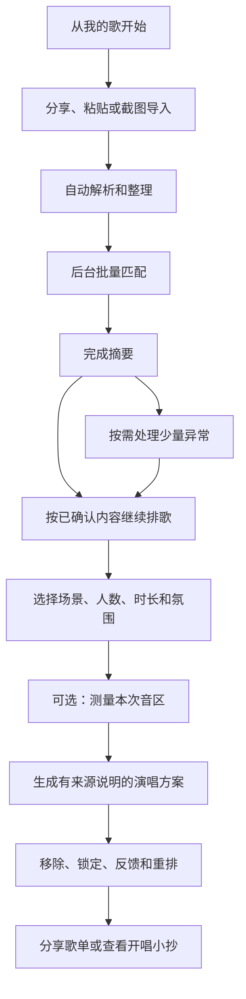

# 歌单导入与排歌价值闭环设计

## 1. 背景与问题

当前版本已经具备导入解析、歌曲整理、本地参考匹配、偏好画像、音区测量、场景编排、反馈重排和导出能力，但用户实际感知到的链路仍然断裂：

- 导入完成后，页面主要反馈“解析了多少首”“参考命中了多少首”，没有说明这些结果接下来会改变什么。
- 匹配页把逐首核对放在最显眼的位置。歌单越大，越像一项必须做完的人工任务。
- “测一下音域”“去选场景”描述的是下一步操作，不是用户最终能得到的结果。
- 结果页没有清楚展示原歌单歌曲与补充推荐的构成，用户无法验证导入是否真的参与排歌。
- “本地参考命中”“外部候选”等内部概念较多，容易被误解为真实 KTV 门店可点或完整音乐平台曲库。

因此，本轮不是单纯扩大曲库或调整几个按钮，而是重新建立一条可理解、可恢复、可验证的完整价值链。

## 2. 核心定位

歌单导入的核心价值定义为：

> 把用户平时爱听的歌，整理成更适合当次场景、更容易接唱、顺序更合理的演唱方案。

导入不是以下能力：

- 不搬运音乐平台的音频、歌词、封面或播放权限。
- 不等于把歌曲同步进一个可播放的本地音乐库。
- 不代表歌曲在任一地区、门店或设备中实时可点。
- 不要求用户把整份歌单逐首确认后才能继续。

匹配只是中间的质量步骤。用户可感知的终点是：

1. 知道这份歌单已经有多少内容可用于排歌。
2. 看见系统从歌单中理解到的偏好和演唱特征。
3. 得到一份有顺序、有来源说明、有推荐理由的演唱方案。
4. 能通过简单反馈继续调整并分享结果。

## 3. 已选方案

### 3.1 方案比较

#### 方案 A：匹配优先

导入后先要求用户完成逐首核对，再进入画像和排歌。

- 优点：每一条数据都经过人工确认。
- 缺点：操作量随歌单歌曲数线性增长，几百首歌无法实际使用；用户会把匹配误认为产品终点。

#### 方案 B：完全自动

所有候选都自动采用，直接生成结果。

- 优点：速度快，用户几乎没有操作。
- 缺点：同名歌曲、缺歌手、翻唱版和现场版容易误认；错误候选会污染画像和推荐。

#### 方案 C：闭环优先、异常后置

系统自动处理高确定性歌曲，只隔离真正有歧义的少量项目；用户可以先按已确认内容排歌，异常项稍后再处理。

- 优点：大歌单的操作量取决于异常数，而不是歌曲总数；同时守住推荐可信度。
- 缺点：需要清楚区分“已核对”“待确认”“暂未找到”，并在推荐入口严格过滤未确认候选。

本设计采用方案 C。

## 4. 产品原则

1. **结果先于过程**：页面先告诉用户可以得到什么，再解释系统如何处理。
2. **自动处理正常项**：高确定性结果自动进入可用集合，不要求逐首点击。
3. **异常不阻塞主流程**：待确认和未找到歌曲单独收纳，不阻止按已确认歌曲排歌。
4. **来源必须可见**：最终结果明确区分原歌单歌曲、根据偏好补充的歌曲和待核对外部候选。
5. **确定性结论只使用确定性数据**：未确认候选不能进入偏好画像、推荐池、风险判断或结果数量。
6. **所有数字可追溯**：页面展示的导入数、已核对数、待确认数、原歌单入选数和补充数必须由同一份运行时数据计算，不能写死。
7. **操作量不随歌单规模线性增长**：100 首、500 首或 1000 首歌单不应转化成对应数量的人工确认任务。
8. **不夸大数据能力**：本地参考只用于早期推荐验证；公开搜索结果只提供候选元数据。

## 5. 端到端用户流程

### 5.1 首页

首页不再把“导入歌单”和“核对参考匹配”展示成两个并列目标。顶部只给出一个随当前状态变化的主要动作。

#### 没有导入内容

- 标题：`把常听歌单，变成今晚更好唱的顺序`
- 说明：`导入后会整理歌名、核对歌曲参考，再结合场景和可选音区排成一份可以直接分享的歌单。`
- 主操作：`导入我的歌单`
- 次操作：`先用示例看看`

#### 已导入、尚未完成匹配

- 标题：`《歌单名》已经放进来了`
- 摘要：`共 N 首，正在核对歌曲参考。完成后就能按这份歌单排歌。`
- 主操作：`继续准备这份歌单`

#### 匹配已完成或部分完成

- 标题：`这份歌单已经可以用来排歌`
- 摘要：`N 首已核对，M 首待确认；待确认歌曲不会影响继续排歌。`
- 主操作：`按这份歌单排今晚歌单`
- 次操作：`查看待确认歌曲`

#### 已有计划

- 标题：`今晚歌单已经排好`
- 摘要：`共 N 首，其中 X 首来自《歌单名》，Y 首为补充推荐。`
- 主操作：`继续调整`
- 次操作：`发给朋友`、`查看开唱小抄`

### 5.2 导入入口

保留三种真实可达方式：

1. 分享或粘贴歌单链接。
2. 粘贴歌曲文字。
3. 选择歌单截图并在本机识别。

来源边界：

- Apple Music 与网易云音乐官方公开歌单页可以尝试直接读取公开内容。
- QQ 音乐仅有链接时不承诺直接读取；提示用户分享包含歌名的原文、粘贴歌曲文字或使用截图。
- 登录墙、私密歌单、动态页面和仅 App 内可见内容无法可靠读取时，不显示为“识别失败，请重试”，而是给出明确替代方式。
- 不调用音乐平台私有接口，不绕过登录或访问控制。

入口文案：

- 页面标题：`选一种方式导入`
- 链接输入说明：`粘贴公开歌单链接；如果页面不能直接读取，可以改用分享原文或截图。`
- 文本输入说明：`一行一首，带上歌手会识别得更准。`
- 截图说明：`选择歌单截图，歌名识别只在本机进行。`

### 5.3 解析与整理

解析过程按阶段反馈，不使用笼统的“处理中”：

1. `正在读取歌单内容`
2. `正在整理歌名和歌手`
3. `正在去除重复内容`
4. `已整理 N 首歌`

整理规则：

- 自动去除完全重复的歌曲条目，保留原始顺序。
- 空歌名不能进入匹配。
- 低置信度 OCR、明显缺失的歌名或被错误拆行的内容进入“需要看一眼”，不要求用户检查所有歌曲。
- 用户可以批量删除明显无效条目，也可以编辑单首歌名或歌手。
- 大歌单默认只展开需要处理的条目；完整列表按需查看，并使用分批或懒加载展示。

解析完成态：

- 标题：`N 首歌已经整理好`
- 说明：`下一步会核对歌曲参考，用来判断难度、合唱适配和排歌顺序；这不代表 KTV 门店实时可点。`
- 主操作：`核对歌曲参考，继续排歌`

### 5.4 批量匹配

每首导入歌曲只能进入以下三个用户可理解的状态：

#### 已核对

满足高确定性匹配条件，或已经由用户明确确认。

- 可以进入偏好画像。
- 可以进入推荐候选池。
- 可以参与难度、高音、合唱、场景等确定性统计。

#### 待确认

存在同名不同歌手、缺歌手、多个版本或候选冲突。

- 不进入偏好画像中的歌曲属性统计。
- 不进入推荐候选池。
- 不计入“已核对”数量。
- 可以使用导入文本中明确存在的歌手名称作为弱偏好信号，但不能由候选反推用户偏好。
- 用户可以单首确认，也可以暂不处理。

#### 暂未找到

本地参考中没有可靠候选。

- 不进入确定性的歌曲难度、音区、KTV 常见度和场景适配判断。
- 导入内容中明确存在的歌手名称可以用于弱偏好和用户主动触发的同歌手公开搜索。
- 不阻止继续排歌。

批量操作只提供安全动作：

- `先按已核对歌曲排歌`
- `暂不处理全部待确认歌曲`
- `只看待确认`
- `只看暂未找到`

不提供“全部采用第一候选”之类会批量制造错误身份的操作。

页面结构：

1. 顶部先显示完成摘要和继续排歌按钮。
2. 中部显示歌单分析摘要。
3. 底部才是可折叠的歌曲明细。
4. 默认只展开异常项；已核对列表折叠，并按批次加载。

完成态文案：

- 全部完成：`N 首歌曲参考已核对，可以开始排歌了。`
- 部分完成：`已核对 X/N 首，Y 首待确认，Z 首暂未找到。可以先按已核对内容排歌。`
- 没有可用参考：`暂时没有找到可用的本地参考。仍可以按歌手和场景排一份基础歌单，歌曲难度和音区判断会相应减少。`

主操作统一为：`按这份歌单排一版`

### 5.5 歌单分析

歌单分析用于解释系统从已确认数据中理解到了什么，不把图表本身当作最终价值。

展示内容：

- 常听歌手。
- 主要语种、年代和曲风。
- 合唱友好度、整体难度和高音压力。
- 更适合的场景。

首屏使用自然结论，例如：

> 华语流行和熟悉旋律比较多，周杰伦、孙燕姿经常出现。朋友局可以先用大家会接的歌热场，高音较多的歌放到状态起来以后。

统计不足时明确说明依据有限，不输出精确画像。

### 5.6 场景与音区

场景页必须让用户看见刚才导入的内容仍在参与本次排歌。

固定显示本次输入摘要：

> 本次会使用：N 首导入歌曲 · X 首已有参考 · 朋友局 · 6 人 · 90 分钟 · 常见音区参考

用户可调整：

- 场景。
- 人数。
- 时长。
- 氛围。
- 难度偏好。
- 合唱偏好。

音区测量是增强项，不是继续排歌的门槛：

- 主流程按钮：`按以上条件排歌`
- 可选操作：`测一下本次音区，排得更贴合`
- 未测量时使用明确标记的常见音区参考，不写成用户个人实测。

### 5.7 结果页

结果页首先回答“刚才导入的歌单到底起了什么作用”。

计划级摘要：

> 根据《歌单名》、朋友局 6 人和 90 分钟时长，共排出 N 首：其中 X 首来自原歌单，Y 首是根据常听歌手和曲风补充的歌曲。

每首歌曲必须持久化并展示来源之一：

- `来自你的歌单`
- `同歌手补充`
- `按曲风补充`
- `按场景补充`
- `热门补充`
- `公开候选 · 待核对`

来源与推荐理由是两个维度。来源回答“这首歌从哪里来”，推荐理由回答“为什么这样排”。推荐理由可以包括：

- `副歌好接，适合朋友一起唱`
- `和这场的氛围比较搭`
- `本次唱到的音区与歌曲接近`
- `高音较多，状态起来后再唱`

外部公开候选仍保持单独的待核对区，不混入已核对计划，也不输出未知的难度、音区或 KTV 可用性判断。

结果页主要操作顺序：

1. `发给朋友` 或 `保存练唱单`
2. `查看开唱小抄`
3. `继续调整`
4. `调整场景`

### 5.8 反馈与重排

用户可以对单曲选择多个互不覆盖的反馈：

- 喜欢。
- 太高。
- 不熟。
- 唱过。
- 适合合唱。
- 不想唱或直接移除。

反馈后立即重排，并给出可验证的完成反馈：

> 已根据你的 3 条反馈重新调整：2 首高音歌曲已后移，1 首不熟悉的歌曲已替换。

如果实际变化无法支持具体描述，则使用保守文案：

> 已根据你的 3 条反馈重新调整歌单。

用户可以撤销最近一次反馈或恢复已移除歌曲。锁定歌曲不会在重排时静默消失。

### 5.9 分享与现场使用

分享内容延续结果页的可信边界：

- 群聊精简文本只包含场景、分段、顺序和歌名。
- 详细文本可以包含来源、推荐理由、注意事项和备选歌。
- 海报和开唱小抄不展示内部评分。
- 外部候选必须保留“待核对”标识。

## 6. 本地参考曲库与联网查询

### 6.1 本地参考曲库

本地参考曲库可以继续增加，但必须遵循以下合同：

- 每首歌曲有稳定 ID、规范化歌名、歌手和来源。
- 只有经过维护的本地数据才能带有难度、音区、高音风险、合唱分数和场景标签。
- 数据扩充不能只堆歌名；缺少可靠演唱属性的歌曲只能作为元数据候选。
- 同歌同歌手的不同版本要么明确标记版本，要么在匹配阶段要求确认。
- 扩充后重新运行重复项、别名冲突、规范化碰撞和性能检查。

### 6.2 联网查询

当前可用的轻量方案是 Apple iTunes Search 公开接口，用于查找同歌手公开曲目元数据。它能返回歌名、歌手、专辑和公开链接，但不能回答：

- 是否在某家 KTV 可点。
- 适合什么音区。
- 演唱难度。
- 高音风险。
- 是否适合合唱或某种现场场景。

因此联网结果只能作为“公开候选 · 待核对”，不能自动补齐本地参考属性，也不能伪装成相似歌曲算法。

联网失败、超时或取消时：

- 已完成的本地匹配和排歌能力不受影响。
- 页面提示：`暂时没找到更多公开候选，可以先用已经核对的歌曲排歌。`
- 旧歌单的迟到响应不得写入当前歌单。

## 7. 数据与架构设计

### 7.1 展示摘要

增加由真实状态计算的展示模型，避免各页面自行拼接数字：

- `PlaylistPreparationSummary`
  - 导入歌曲总数。
  - 有效整理数。
  - 已核对数。
  - 待确认数。
  - 暂未找到数。
  - 是否允许继续排歌。

该模型由当前 `ImportedPlaylist`、整理草稿和 `MatchResult` 计算，不单独持久化为第二份真源。

### 7.2 推荐来源

增加可编码的歌曲来源枚举，例如 `SongRecommendationOrigin`：

- `importedMatch`
- `sameArtistSupplement`
- `styleSupplement`
- `sceneSupplement`
- `popularSupplement`
- `provisionalExternal`
- `legacyUnknown`

`SongPlanItem` 在生成时记录来源；旧快照解码时回退为 `legacyUnknown`。结果页、详细导出和恢复后的计划都读取同一字段，不在界面层重新猜测来源。

### 7.3 计划来源摘要

`SongPlan` 增加可选的生成摘要，例如 `SongPlanGenerationSummary`：

- 歌单 ID 与当时的显示名称。
- 导入总数、已核对数、待确认数和暂未找到数。
- 原歌单入选数与补充推荐数。
- 生成时采用的场景、人数、时长和音区来源。
- 本次采用的反馈数量。

旧快照缺少摘要时使用保守的旧版展示，不伪造来源数字。

### 7.4 推荐候选安全门

推荐引擎只允许以下内容进入确定性候选池：

- `acceptedTrack` 存在且不处于 `required` 状态的匹配结果。
- 已确认采用的替代歌曲。
- 本地参考曲库中符合偏好或场景的歌曲。
- 用户明确锁定且数据合同允许参与的歌曲。

以下内容不得进入确定性候选池：

- 待确认匹配的候选。
- 未被采用的 alternatives。
- 暂未找到歌曲的猜测结果。
- 只有公开元数据、缺少本地演唱属性的外部候选。

外部候选只能在单独的待核对区展示，除非后续经过明确确认并拥有满足计划所需的数据合同。

### 7.5 状态失效与恢复

- 导入内容、歌名、歌手、删除结果或匹配确认变化后，画像和旧计划失效并按需重建。
- 场景、人数、时长、氛围、音区或反馈变化后，旧计划失效或立即重排。
- 页面离开、取消、超时和切换歌单都会使旧异步请求 token 失效。
- 当前整理、匹配、画像、场景、计划、反馈、锁定和移除状态继续使用版本化快照恢复。
- 新增可选字段必须兼容旧快照，解码旧数据不能崩溃或冒充新来源。

## 8. 大歌单性能与交互合同

### 8.1 性能目标

- 1000 首本地匹配在支持设备或测试环境中保持在现有 5 秒性能门限内。
- 匹配不为每首歌曲重复构建全曲库规范化索引。
- 结果统计在单次遍历中计算。
- 页面不一次渲染全部歌曲卡片；默认展示摘要、异常项和首批明细。
- 取消后不得继续发布匹配、解析或联网结果。

### 8.2 操作目标

- 零异常歌单：从导入完成到开始选场景只需要一次主操作。
- 有异常歌单：用户可以不处理异常，直接按已确认歌曲排歌。
- 人工操作数量只与用户主动选择处理的异常数有关，不与歌曲总数绑定。
- 任意长列表的继续按钮都位于摘要区或固定底部，不要求滚动到列表末尾。

## 9. 错误与空状态

| 情况 | 用户看到的说明 | 可执行操作 |
| --- | --- | --- |
| 没有解析出歌曲 | `这段内容里还没找到歌名。可以粘贴带歌名的分享原文，或者改用截图。` | 重新粘贴、选截图 |
| 只解析出部分内容 | `已整理 N 首，另外 M 条暂时看不出完整歌名。` | 先用 N 首继续、查看 M 条 |
| 全部待确认 | `这些歌曲还缺少足够的歌手或版本信息。补充歌手会更准，也可以先按现有偏好排基础歌单。` | 补充信息、继续基础排歌 |
| 全部未找到 | `本地参考里暂时没有这些歌。仍可以按歌手和场景排基础歌单。` | 排基础歌单、找同歌手候选 |
| 联网失败 | `暂时没找到更多公开候选，可以先用已经核对的歌曲排歌。` | 继续排歌、稍后重试 |
| 用户取消 | `已停止本次处理，之前的歌单和结果都还在。` | 返回、重新开始 |
| 歌单发生变化 | `歌单内容已经更新，需要重新排一版。` | 重新排歌 |
| 候选不足 | `按当前条件找到了 N 首，先把这些排好。` | 查看结果、放宽条件 |
| 旧数据缺少来源 | `这份歌单来自旧版本，部分来源信息没有记录。` | 继续使用、重新生成 |

## 10. 中文文案规范

### 10.1 使用用户语言

优先使用：

- `歌曲参考已核对`
- `按这份歌单排一版`
- `待确认歌曲不影响继续排歌`
- `来自你的歌单`
- `根据常听歌手补充`
- `状态起来后再唱`

避免使用：

- `参考命中率 87%`
- `候选池构建完成`
- `画像生成成功`
- `执行匹配`
- `KTV 可点`
- `智能识别无误`

### 10.2 不做绝对承诺

- 不写“全部识别成功”，改为“已整理 N 首”。
- 不写“都能唱”，改为“已有 N 首本地参考”或“可以用于排歌”。
- 不写“最适合你”，改为“更贴合本次场景”或“可以优先考虑”。
- 不写“相似歌曲”，除非未来确实实现并验证音乐相似度算法。

### 10.3 先结论、后说明

推荐结构：

> **这份歌单已经可以用来排歌**  
> 已核对 253 首，15 首待确认。待确认歌曲不会影响继续排歌。

不采用：

> 本地参考匹配已完成 253/268，匹配率 94.4%，请继续处理异常候选。

## 11. 验收标准

### 11.1 功能验收

- 导入完成后，用户不阅读说明文档也能在首屏知道下一步会得到一份演唱方案。
- 高确定性歌曲自动处理；待确认歌曲不会被批量强制确认。
- 存在已核对歌曲时，用户可以跳过全部异常直接进入场景排歌。
- 待确认候选和未采用 alternatives 不进入偏好属性统计或确定性推荐池。
- 结果页可见展示原歌单入选数与补充推荐数，二者之和等于计划歌曲总数；待核对区不混入该总数。
- 每首计划歌曲显示持久化来源，恢复 App 后来源不变化。
- 用户修改歌单、匹配、场景、音区或反馈后，不继续展示已过期计划。
- 联网失败不影响本地导入、匹配和排歌。
- 旧快照可以安全恢复，缺少新字段时使用保守文案。

### 11.2 规模验收

- 10、100、500、1000 首文本歌单均可完成解析、整理和匹配。
- 500 首以上歌单不会一次渲染全部歌曲卡片。
- 零异常时，1000 首歌单也不要求用户逐首点击。
- 有 20 首异常时，用户最多只需要处理主动选择的 20 首；也可以零处理继续排歌。
- 取消或切换歌单后，旧任务不得覆盖新状态。

### 11.3 文案验收

- 首页、导入完成、匹配完成、场景、结果、反馈、分享和错误状态均说明“当前发生了什么、接下来能得到什么、现在可以做什么”。
- 普通可见界面不以“匹配率”作为主结论。
- 任何页面都不把本地参考或公开搜索写成门店实时可点。
- 音区未实测时不使用“你的音域”等个人化结论。
- 示例歌单、用户导入和热门兜底使用各自真实来源文案。

### 11.4 验证方式

- SharedKit 单元测试覆盖匹配状态、摘要计数、候选安全门、来源分类、旧快照兼容和大歌单性能。
- App 状态测试覆盖首页下一步、完成摘要、异常过滤、场景输入摘要、结果来源和反馈重排反馈。
- UI 测试覆盖无异常、部分异常、全部未找到、联网失败、取消、恢复和大字号。
- 最终运行 `swift test`、聚焦 iOS 测试、完整 UI 测试、模拟器 Release 构建、两套字号截图和 `./scripts/validate.sh`。
- 真机验收至少覆盖分享导入、截图识别、音区测量、系统分享和重启恢复。

## 12. 实施优先级

### P0：正确性与价值可见

- 修复未采用 alternatives 进入推荐池的问题。
- 增加匹配完成摘要和“不处理异常也能继续”的主路径。
- 场景页显示本次输入摘要。
- 结果页显示计划来源摘要和每首歌曲来源。
- 补齐旧快照兼容与来源计数测试。

### P1：大歌单正常人操作

- 默认折叠已核对明细，只突出异常。
- 增加安全过滤与“暂不处理全部待确认歌曲”。
- 首页改为随状态变化的单一主要动作。
- 反馈后展示本次调整结果。

### P2：数据覆盖与持续扩充

- 按稳定 ID、别名、版本和来源合同扩充本地参考曲库。
- 增加曲库重复、冲突、碰撞和性能门禁。
- 保留公开元数据与本地演唱属性之间的严格边界。

## 13. 不在本轮范围

- 真实 KTV 厂商曲库、门店库存和设备控制。
- 音乐平台私有接口、账号授权、版权音频、歌词、MV 和封面同步。
- 将 Apple 公开搜索包装成歌曲相似度服务。
- 云端账号、跨设备同步和多人实时协作。
- 现场播放、切歌或点歌队列控制。

